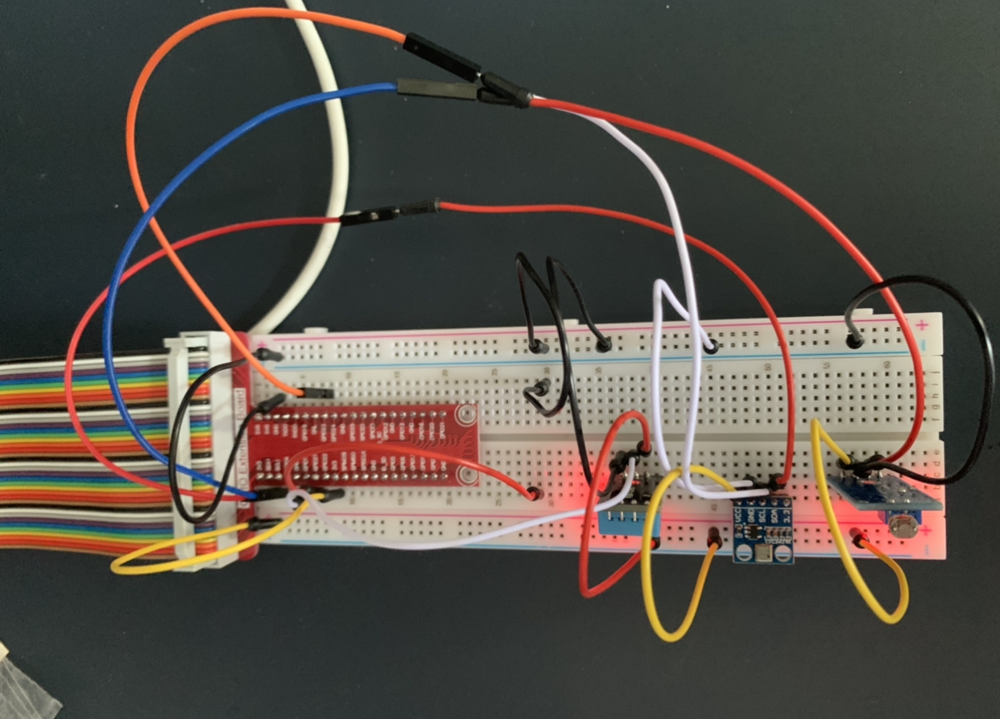

# Raspberry Pi Weather Logger
This is a repository for my CPS342 - Embedded Linux final project. For this final project I have decided to build a weather logger that will keep track of the local weather in my area, track the data and display it on a website that is run with Flask. This weather logger will keep track of the temperature, humidity, pressure, and will tell you if the sun is still out by detecting if there is still light outside or not. It will graph the temperature throughout the day, and display the current stats of the each variable. 

## Getting Started
Following the instructions below will help you build your own weather logger with the raspberry pi. 

### Hardware Needed
    Raspberry Pi
    Breadboard
    Jumper wires
    Adafruit DHT temperature and humidity sensor 
    BMP180 Pressure Sensor 
    Photosensitve Light Module 

### Installing 
We will start by wiring and installing the BMP180 Pressure sensor. You will need to start by wiring up the sensor. The BMP180 has 3 wires that need to be connected to the raspberry pi GPIO. Start by connecting the 3v3 to the + strip on the breadboard so that it gives power to that whole strip and yopu can power multiple things. Start by taking a jumper wire, connect it to the VCC port on the BMP pressure sensor and then connect it to the strip that we powered. Take another jumper wire, and plug it into the ground port and plug into the "-" side of the breadboard to power the whole side. Then take a jumperwire and connect it to the ground port of the sensor and the ground strip we powered. Finally take the last jumper wire, connect it to the DO port on the sensor and plug it into the SDA1 port on the GPIO. 

Once that is finished, you will need to clone this repository in order to get the sensor to work. 

    git clone https://github.com/adafruit/Adafruit_Python_BMP.git

After you clone that repository follow these next steps: 
    
    sudo nano /etc/modules

    Add these two lines to the bottom of the file:

    i2c-bcm2708
    i2c-dev

    sudo raspi-config
    Under “Advanced Options” you activate the automatic loading of the I2C bus. Restart your Raspberry.

    Install this: 
    sudo apt-get install python-smbus i2c-tools git

    Finally, you can then run this: 
    i2cdetect -y 1
    It should show:

         0  1  2  3  4  5  6  7  8  9  a  b  c  d  e  f
    00:          -- -- -- -- -- -- -- -- -- -- -- -- --
    10: -- -- -- -- -- -- -- -- -- -- -- -- -- -- -- --
    20: -- -- -- -- -- -- -- -- -- -- -- -- -- -- -- --
    30: -- -- -- -- -- -- -- -- -- -- -- -- -- -- -- --
    40: -- -- -- -- -- -- -- -- -- -- -- -- -- -- -- --
    50: -- -- -- -- -- -- -- -- -- -- -- -- -- -- -- --
    60: -- -- -- -- -- -- -- -- -- -- -- -- -- -- -- --
    70: -- -- -- -- -- -- -- 77 

Now we are going to backtrack and work with the directory that we cloned since the I2C bus is working. The next steps are as followed: 

    cd Adafruit_Python_BMP
    sudo python setup.py install

After running those two commands, the sensor should be able to work now and you can now clone this repository and use the code in this repository to run the sensor. 

Next, we will connect the last two sensors. It pretty much works the same as installing the pressure sensor. 

For the humidity sensor, there are 3 things that need to be plugged in. 
Start by plugging the ground and VCC in, just like how we did for the pressure sensor. All you need to do is connect them to their ports on the sensor and then on the "+" strip and the "-" strip of the breadboard. Then there is data port, plug a jumperwire into the GPIO17 port. 

For the light sensor, plug the ground into the ground and VCC into VCC. Finally there is a DO port and you plug that into GPIO 23. 

All the sensors should be wired up at this point. Below is a picture of my sensors and breadboard.

